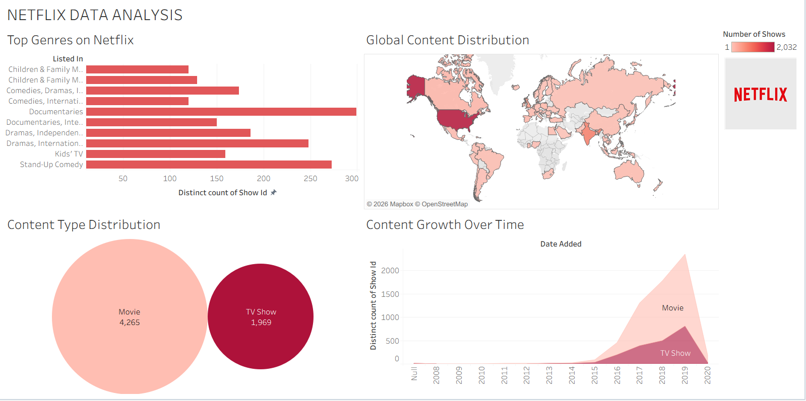

# 🎬 Netflix Content Analysis Dashboard (Tableau)

## 📌 Overview
This project analyzes Netflix content using Tableau to uncover trends in content distribution, genres, and growth over time. The dashboard provides a visual understanding of how Netflix content has evolved globally.

## 🎯 Objectives
- Analyze global distribution of Netflix content
- Identify popular genres
- Study growth trends of Movies vs TV Shows

## 🛠️ Tools Used
- Tableau

## 📊 Key Features
- Interactive dashboard with multiple visualizations
- Global content distribution map
- Genre-wise content analysis
- Content type comparison (Movies vs TV Shows)
- Year-wise growth trend

## 📈 Key Insights
- Movies dominate Netflix content compared to TV Shows
- Significant growth in content after 2015
- USA has the highest number of shows available

## 📸 Dashboard Preview

## 📂 Files Included
- `NETFLIX_DATA_ANALYSIS.twbx` – Tableau packaged workbook
- `NETFLIX_ANALYSIS_DASHBOARD.png` – Dashboard preview image

## 🚀 How to Use
1. Download the `.twbx` file
2. Open using Tableau Public or Tableau Desktop
3. Explore the dashboard interactively

---